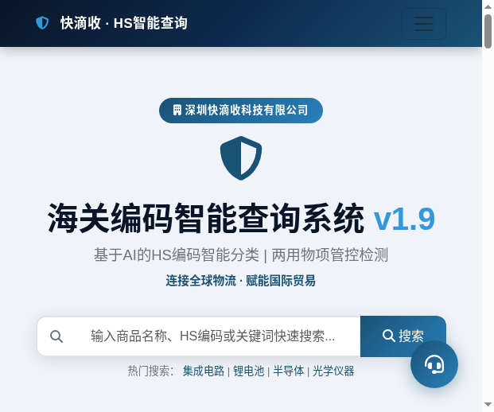
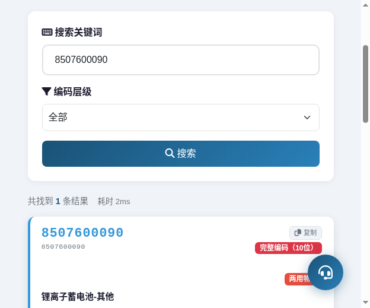
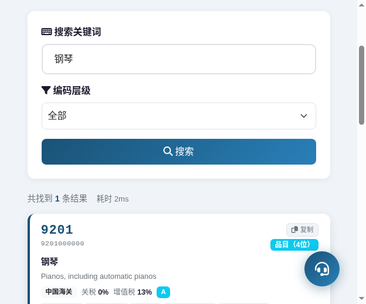
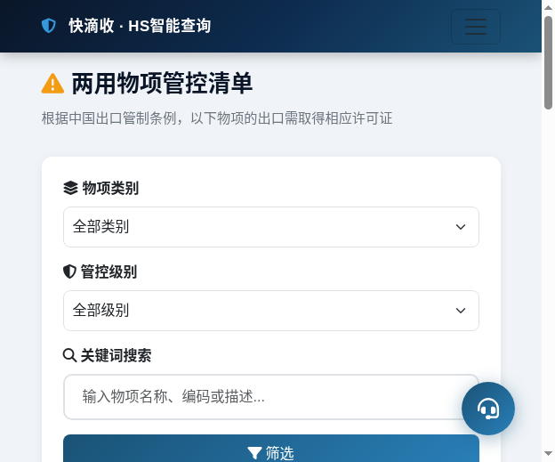
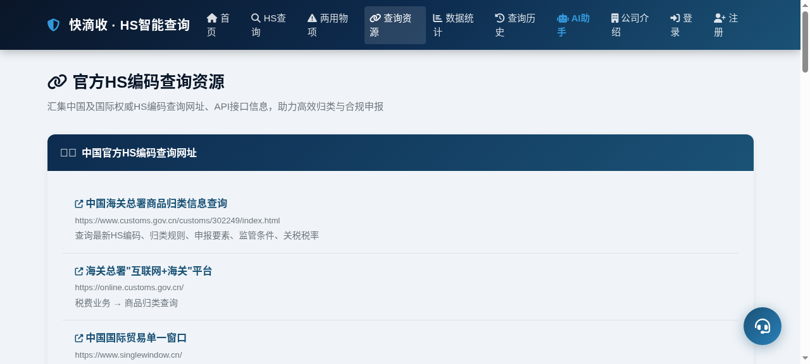
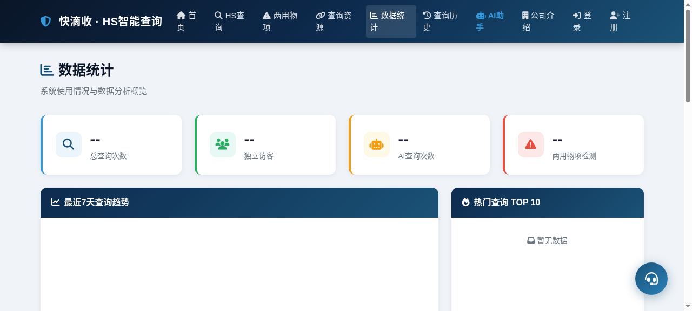
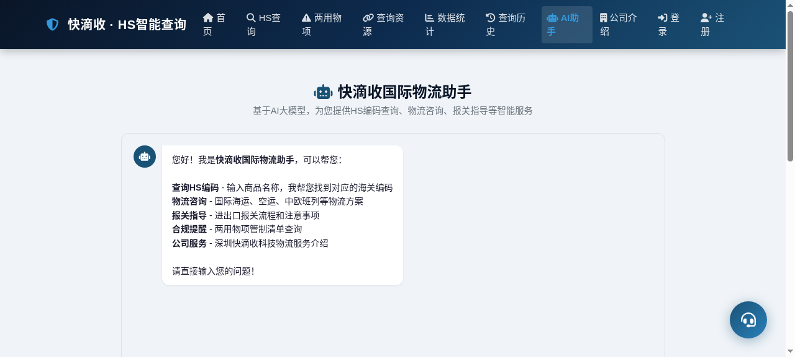
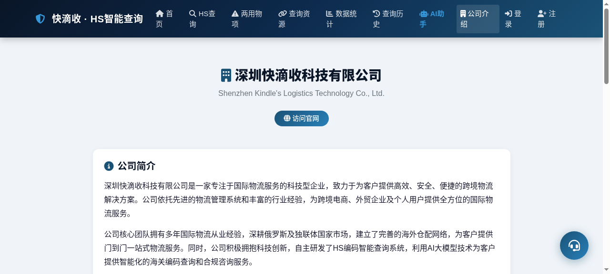

<p align="center">
  <h1>快滴收 · HS智能查询系统</h1>
</p>

<p align="center">
  <strong>深圳快滴收科技有限公司</strong>
</p>

<p align="center">
  
  
  
  
</p>

---

## 项目简介

快滴收 · HS智能查询系统是一款面向国际贸易、物流货代行业的智能海关编码查询平台。系统整合了本地HS编码数据库与多个国际权威数据源，结合AI大模型实现智能分类、两用物项自动检测及自我学习机制，为用户提供精准、高效的HS编码查询体验，助力企业合规通关、降低贸易风险。

---

## 核心功能

- 🔍 **HS编码智能查询** — 支持中文关键词、英文关键词、HS编码三种搜索方式，结果以卡片形式直观展示，点击可查看完整详情
- 🤖 **AI智能分类** — 接入OpenRouter大模型，自动对商品进行HS编码归类，支持多模型自动切换保障服务可用性
- ⚠️ **两用物项检测** — 自动标记可能涉及出口管制的商品，关联管制清单，帮助企业规避合规风险
- 🧠 **自我学习机制** — 当本地数据库查询无结果时，AI自动分析并学习新商品分类，持续丰富知识库
- 🌐 **外部权威数据源集成** — 整合中国海关总署、WCO HS DataHub、法国海关开放数据、UK Trade Tariff等多个国际数据源，提供多维度交叉验证
- 💬 **全局AI助手** — 悬浮聊天窗口覆盖所有页面，随时解答HS编码、报关、物流等问题
- 📚 **知识库管理** — 支持HS编码数据的批量导入与导出，方便数据维护与迁移
- 📊 **数据统计仪表盘** — 可视化展示查询量趋势、热门查询关键词、用户活跃度等关键指标
- 📝 **查询历史记录** — 自动保存用户查询记录，支持时间筛选，方便回溯与复用

---

## 系统页面介绍

### 首页
系统入口页面，提供快速搜索框、热门查询关键词标签云、公司简介及核心服务展示。用户无需登录即可体验基础搜索功能，同时了解快滴收科技的专业服务能力。



### HS查询
核心查询页面，支持三种搜索模式：关键词搜索（中/英文）、HS编码精确查询、分类导航浏览。查询结果以卡片形式展示，包含编码、中英文名称、税率、监管条件、海关查询快捷入口等关键信息，点击可展开详情弹窗。



当本地结果较少时，系统自动调用中国海关总署、WCO、HS DataHub等外部权威数据源进行补充查询，结果以卡片形式展示，支持点击查看详情和一键复制，默认折叠仅显示2行，可展开查看全部。



### 两用物项
出口管制商品清单浏览页面，按管制类别分类展示两用物项目录。支持按类别筛选（核材料、导弹、生化武器、电子计算机、航空航天等10大类）、风险级别筛选、关键词搜索，每条记录关联对应的HS编码，帮助企业快速识别管制商品，规避出口合规风险。



### 查询资源
海关查询网址汇总页面，收录了中国海关总署、国际贸易单一窗口、WCO世界海关组织、EU TARIC欧盟综合关税、法国海关、互联网+海关等权威查询平台的链接，以及多个第三方API服务接口，为用户提供一站式查询入口。



### 数据统计
管理后台数据可视化页面，通过图表展示系统查询量趋势、热门查询关键词排行、HS章节查询分布、用户活跃度统计等关键运营指标，辅助管理者了解系统使用情况。



### 查询历史
个人查询记录页面，按时间倒序展示用户的历史查询，支持按日期范围筛选。用户可快速回顾之前的查询结果，提高工作效率。

### AI助手
全功能AI对话页面，基于大语言模型提供智能问答服务。内置快捷问题按钮，支持HS编码咨询、商品归类建议、报关流程指导、物流方案推荐等多种场景，是用户的智能贸易助手。



### 公司介绍
深圳快滴收科技有限公司详细介绍页面，展示公司核心业务（国际海运、中欧班列、中亚卡车、国际空派、国际快递、海外仓储、展会物流）、HS编码智能查询系统功能介绍及联系方式。



### 管理后台
系统管理控制台，提供用户管理（账号审核、权限分配）、知识库管理（HS编码增删改查、批量导入导出）、数据维护（两用物项清单更新）、系统设置（AI模型配置、API密钥管理）等功能模块。

---

## 技术架构

| 层级 | 技术栈 |
|------|--------|
| **后端** | Python 3.10 + Flask + SQLite (WAL模式) |
| **前端** | Bootstrap 5 + Font Awesome + Vanilla JavaScript |
| **AI引擎** | OpenRouter API（多模型自动切换，支持NVIDIA Nemotron、MiniMax、Qwen、Gemma、Llama等） |
| **数据源** | 本地SQLite数据库 + 中国海关总署(hsbianma.com) + WCO HS DataHub + pyhscodes本地库 + 法国海关(DGDDI) + UK Trade Tariff |

---

## 快速开始

### 环境要求

- Python 3.8 及以上
- pip 包管理器

### 安装步骤

```bash
# 1. 克隆项目
git clone <repository-url>
cd hs_query_system

# 2. 创建虚拟环境（推荐）
python3 -m venv venv
source venv/bin/activate  # Linux/Mac
# venv\Scripts\activate   # Windows

# 3. 安装依赖
pip install -r requirements.txt

# 4. 初始化数据库
python init_data.py

# 5. 启动服务
python app.py
```

启动后访问 `http://localhost:5000` 即可使用系统。

---

## 公司信息

| 项目 | 内容 |
|------|------|
| **公司名称** | 深圳快滴收科技有限公司 |
| **官方网站** | [kindles-logistics.com](https://kindles-logistics.com) |
| **联系电话** | 13923658327 |
| **公司地址** | 深圳市龙岗区平湖街道平安大道1号二栋10楼 |

---

<p align="center">
  <strong>快滴收 · HS智能查询系统</strong>
  <br>
  <em>智能查询，合规通关，高效贸易</em>
</p>
